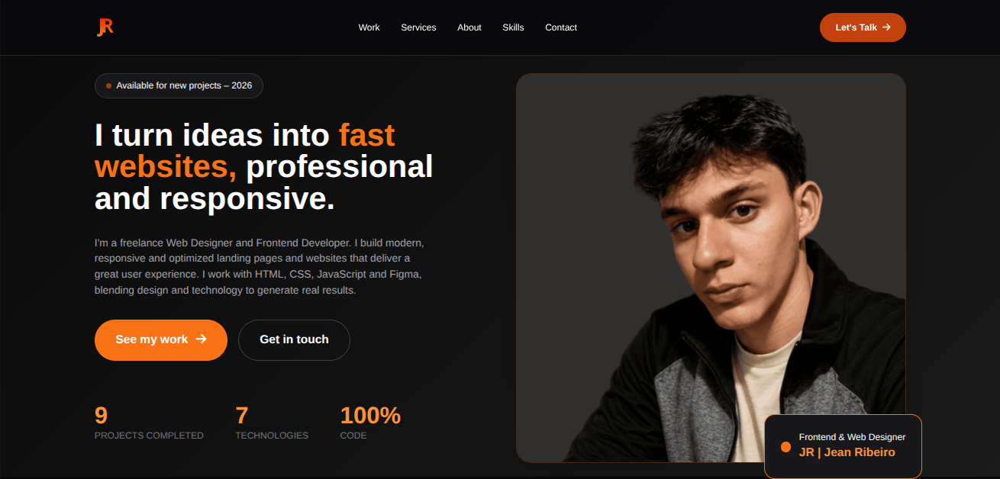

# 👋 Hello, I'm Jean Ribeiro

### 💻 Junior Web Developer | Frontend

🇧🇷 Brazil · 🌎 Open to International Remote Opportunities

I'm a Web Developer with a Technical Degree in Internet Computing, focused on building responsive and modern web interfaces.

I have hands-on experience developing projects with **HTML, CSS and JavaScript**, using technologies such as **Bootstrap, Tailwind CSS and Sass/SCSS**.

I'm currently expanding my skills in **React, TypeScript and REST APIs**, with the goal of working with modern frontend development and international teams.

---

## 🚀 About Me

- 💻 Focused on Web & Frontend Development
- 🎓 Technical Degree in Internet Computing
- 🌎 Looking for international remote opportunities
- 🧩 Interested in responsive and user-friendly interfaces
- 🎨 Experience with Figma and UI design
- 🌐 Experience with WordPress and Elementor
- 📚 Currently learning React, TypeScript and REST APIs
- 🔧 Building projects to improve my development skills

---

## 🛠️ Tech Stack

### Frontend

### Tools

### 📚 Currently Learning

**Next:** REST APIs · JSON · Node.js · Linux · Docker

---

# 🌐 My Portfolio

### Take a look at my work

  

  <a href="https://jeanribeiro8.github.io/JeanRibeiro/">
    <strong>🌐 Visit My Portfolio →</strong>
  </a>

  

---

# 🚀 Featured Projects

## 🎓 TecSchool

**Technology:** HTML · CSS · JavaScript · Bootstrap

Responsive website for a technology school, developed with a focus on responsive design, structured layouts and interactive web elements.

🌐 **Live Demo:**  
https://jeanribeiro8.github.io/TecSchool/

---

## 🔥 Blaze Agência

**Technology:** HTML · CSS · JavaScript · Tailwind CSS

Responsive marketing agency website with a modern interface, service sections, calls-to-action and responsive navigation.

🌐 **Live Demo:**  
https://blazeagencia.netlify.app/

---

## 🦷 BrightSmile

**Technology:** HTML · CSS · JavaScript · Tailwind CSS

Responsive dental clinic website focused on modern UI, service presentation, contact sections and clear calls-to-action.

🌐 **Live Demo:**  
https://brightsmlle.netlify.app/

---

## 💼 Nexus Consulting

**Technology:** HTML · CSS · JavaScript · Tailwind CSS

Responsive institutional website designed to present company information and services through a modern web interface.

🌐 **Live Demo:**  
https://nexusconsultin.netlify.app/

---

# 📋 Currently Building

## Kanban Task Manager

A Trello-inspired task management application created to practice modern frontend development.

### Planned Stack

**React · TypeScript · Tailwind CSS**

### MVP Features

- 📋 Boards, lists and cards
- 🔄 Drag & Drop
- 💾 Persistent data
- 📱 Responsive interface

This project is part of my learning journey toward modern frontend development.

---

# 🎯 Career Goals

I'm currently looking for my first professional opportunity in software development, with a focus on **Frontend and Web Development**.

My goal is to work with **international teams in a remote environment**, contribute to real-world projects and continue developing my skills in modern web technologies.

I'm particularly interested in opportunities where I can grow with technologies such as **JavaScript, React and TypeScript**.

---

# 🎓 Education

### Technical Degree in Internet Computing

**ETEC Padre Carlos Leôncio**

2021 – 2023

---

# 🌎 Languages

🇧🇷 **Portuguese** — Native

🇺🇸 **English** — A2 / approaching B1

Currently improving my English communication skills with a focus on professional and technical communication.

---

# 🌎 Connect With Me

📧 **Email:**  
jeanrsantos10@gmail.com

🌐 **Portfolio:**  
https://jeanribeiro8.github.io/JeanRibeiro/

---

  <i>Always learning, building and improving.</i>

# freelance-portfolio
